# teletext-cards

GitHub profile cards in the style of 1980s teletext (Ceefax, DR Tekst-TV),
built from **all** your work: the repositories you own, plus the organisation
and team repositories that the usual stats cards leave out.



<sub>Demo data for a made-up user. Your page fills in from your own GitHub activity.</sub>

## Why another stats card?

Most README stats cards start from the repositories you **own**. That leaves
out a lot:

- **Organisation and team work is missing.** Study projects, company repos and
  open source contributions usually live under an organisation or a teammate's
  account, so they never show up in your repo count, stars or languages.
- **Team forks are invisible.** GitHub never counts commits or pull requests
  in a fork as contributions, and many team projects start as a fork of a
  course or starter repo.
- **Languages are measured in bytes of repos you own, whoever wrote them.**
  A team repo under your name counts in full; the code you wrote somewhere
  else counts as nothing.
- **Shared public servers hit rate limits.** Hosted instances serve thousands
  of profiles from a few tokens, so cards can fail to render when it matters.

teletext-cards works differently:

1. **It starts from your contributions.** GitHub records every commit, pull
   request, issue and review in a yearly *contributions collection*, whoever
   owns the repository. The action walks those back, one year at a time, to the
   day you joined, then adds the forks you opened pull requests in.
2. **Languages follow your commits.** Each repository's language mix is
   scaled by the share of its commits that you authored. Write a quarter of a
   team's Go service and a quarter of its Go counts. Never commit to a repo and
   it does not count, however big it is.
3. **It runs in your own GitHub Actions.** No server, no shared rate limit,
   nothing to go down. The cards are static SVGs, rebuilt on a schedule.
4. **Private work stays private.** With a token that can see private
   repositories, they count towards your numbers, but their names never appear.
   An organisation that is only known through private repositories is shown as
   `+1 private`.

## Quick start

Add `.github/workflows/teletext-cards.yml` to your profile repository (the one
named after your username):

```yaml
name: Teletext cards

on:
  schedule:
    - cron: "17 4 * * *" # every morning
  workflow_dispatch:
  push:
    paths: [.github/workflows/teletext-cards.yml]

permissions:
  contents: write # to push the cards to the output branch

jobs:
  cards:
    runs-on: ubuntu-latest
    steps:
      - uses: Luke3520/teletext-cards@v1
        with:
          publish_branch: output
          subtitle: Developer in Copenhagen|Backend, integrations & ops
          timezone: Europe/Copenhagen
          art: nisse
```

Run it once from the **Actions** tab, then put the page in your `README.md`:

```html

```

`stats.svg` (the numbers, with a 52-week graph) and `languages.svg` are there
too, if you would rather build your own layout:




## Inputs

| Input | Default | What it does |
|---|---|---|
| `github_token` | `${{ github.token }}` | API token. The default sees all public work, including public organisation repos. See [private work](#counting-private-work) and [repo visitors](#repo-visitors). |
| `username` | repository owner | Whose cards to draw. |
| `cards` | `page,stats,languages` | Which cards to draw. |
| `output_dir` | `teletext-cards` | Where to write the SVGs. |
| `publish_branch` | | Force-push the cards as a single commit to this branch, keeping your main history clean. Needs `contents: write`. |
| `publish_token` | `github_token` | Token for that push, if `github_token` is a PAT without push rights. |
| `title` | your name | The big double-height line. |
| `subtitle` | | Up to two lines under the title, split by `\|` or a newline. |
| `brand` | your login | Service name in the header row. |
| `page_number` | `100` | Teletext page number, 100 to 899. |
| `accent` | `blue` | Colour of the title band: `red`, `green`, `yellow`, `blue`, `magenta`, `cyan` or `white`. |
| `art` | `none` | Mosaic pixel art next to the title. `nisse`, `pipe-nisse` (animated: smokes a pipe and wiggles his eyebrows), or your own (see below). |
| `fastext` | | Up to four labels for the red, green, yellow and cyan keys at the bottom. |
| `locale` | `en` | `en` or `da` (Danish). |
| `timezone` | `UTC` | Time zone for the header clock, such as `Europe/Copenhagen`. |
| `languages_by` | `authorship` | `authorship`, `commits` or `bytes` (the classic method). |
| `languages_count` | `5` | Languages listed before the rest become *Other*. |
| `orgs` | | Choose the ORGS line, comma separated. `name` shows that organisation first (even a private one), `name=Label` renames it too, `-name` hides it. The rest follow, busiest first. |
| `hide` | | Parts to leave out, comma separated: `since`, `stars`, `visitors`, `contributions`, `last_7_days`, `streak`, `commits`, `pull_requests`, `reviews`, `repositories`, `orgs`, `languages`, `recent` (recent work, on the page), `activity` (the 52-week graph, on the stats card). Everything shows unless you hide it. |
| `exclude_repos` | | `owner/name` or `owner/*`, comma separated. |
| `exclude_languages` | | Language names, comma separated. |
| `animate` | `true` | The page arrives row by row and the clock blinks. Off for anyone who prefers reduced motion. |
| `crt` | `true` | Phosphor glow, scanlines and a soft vignette. |

### Your own pixel art

`art` takes rows of colour codes: `K` black, `R` red, `G` green, `Y` yellow,
`B` blue, `M` magenta, `C` cyan, `W` white, `.` for empty. Teletext had no
brown, but pixel art may use `N` for it. Each character is one
teletext mosaic pixel, so two across and three down make one character cell.

```yaml
art: |
  ..YY..
  .YYYY.
  YKYYKY
  YYYYYY
  .YRRY.
  ..YY..
```

## How the numbers are counted

| On the card | Where it comes from |
|---|---|
| The line under the title | Takes turns, a few seconds each, like teletext subpages: since when you are on GitHub, your stars, and your repo visitors. A still picture, or a viewer who prefers less motion, gets the first. |
| Stars | Stars on the repositories you own. Left out until you have one. |
| Repo visitors | Unique visitors of your public repositories over the last 14 days, from GitHub's own traffic numbers. See [repo visitors](#repo-visitors). |
| Contributions | Every day in your contribution calendars since you joined, so it matches your profile graph. Includes anonymous private contributions if you show them on your profile. |
| Last 7 days | Your contributions today and in the 6 days before. Until you have done something today, the 7 days before today, so a morning run compares whole days. Compared with an ordinary week: the average of the 12 weeks before (fewer for a new account). More than a quarter above or below it is *more* or *less than usual*. |
| Streak | Days in a row with a contribution, up to today (an empty today does not break it yet), and the longest run since you joined. |
| Commits, code reviews | Summed from each yearly contributions collection. |
| Pull requests | All pull requests you opened, and how many were merged. |
| Repositories | Repositories you own or contributed to, each counted once, including forks you opened pull requests in. *org/team* is how many belong to an organisation or another person. |
| Orgs | Organisations owning a public repository you contributed to, busiest first. |
| Languages | See `languages_by` above. In a fork, only commits made after forking count, so upstream code is not counted twice. |
| Recent work | The three repositories with your latest commits on their default branch, and when: *today*, *yesterday* or the date, in your `timezone`. Your profile repository is left out. A private repository shows as *private repo*, or as its organisation's name if you list that organisation in `orgs`. |
| 52 weeks | On the stats card: your contributions per week over the last year, one mosaic column per week, on a square-root scale so quiet weeks still show next to a busy one. The page leaves this out, because GitHub already shows your contribution graph further down your profile. |

GitHub only counts a commit as yours if its author email is linked to your
account. If old commits are missing, add that email under
**Settings → Emails**.

## Counting private work

The default `github.token` can only see public work. To include private
repositories, create a classic personal access token with the `repo` and
`read:org` scopes, store it as a secret, and pass it in:

```yaml
- uses: Luke3520/teletext-cards@v1
  with:
    github_token: ${{ secrets.TELETEXT_TOKEN }}
    publish_token: ${{ github.token }}
    publish_branch: output
```

Private repositories then count towards the numbers and languages, and show up
in recent work as *private repo*. Their names, and the names of organisations
you only know privately, never appear on a card or in the logs, unless you list
such an organisation in `orgs`.

GitHub's contribution data sometimes hides private work even from your own
token: it shows up only as an anonymous count. When that happens, the action
reads the commit history of every private repository the token can open,
including your organisations' repositories, and counts your commits there
directly.

## Repo visitors

GitHub does not tell anyone who looks at a profile page, so no card can count
profile views honestly. View-counter badges count every time their image
loads, your own visits included, on someone else's server.

What GitHub does count is each repository's traffic: page views and unique
visitors over the last 14 days. The line under the title shows the unique
visitors of your public repositories, added up, so someone who looks at two
of them counts twice. Private repositories are left out: only people who
already have access can visit them.

Only people with push access may read traffic, so the default `github.token`
cannot. Either of these can:

- a classic personal access token with the `repo` scope (the token for
  [private work](#counting-private-work) already has it), or
- a fine-grained token with **Administration: Read-only** on your repositories.

Without one, the visitors stay off the card and the log says why. To leave a
repository out of the count, add it to `exclude_repos`. To drop the visitors
altogether, add `visitors` to `hide`.

## Run it locally

Node 22.18 or newer runs the TypeScript directly; there is no build step.

```sh
GITHUB_TOKEN=$(gh auth token) node src/cli.ts --username octocat --out cards
node src/cli.ts --fixture test/fixtures/demo.json --out examples   # no network
npm run check                                                      # types and tests
```

## How it is drawn

- **Real teletext lettering.** Glyphs come from
  [Bedstead](https://bjh21.me.uk/bedstead/), Ben Harris's public-domain
  recreation of the SAA5050 character generator, including its smoothed
  diagonals. They are embedded as SVG paths, so the cards need no web font and
  look the same everywhere.
- **Teletext rules.** Eight colours, a 40-column grid, double-height text, and
  2 by 3 block mosaics in contiguous and separated styles.
- **One file per card, nothing to load.** GitHub's image proxy blocks external
  resources inside SVGs, so everything is inline. Only the glyphs a card uses
  are included, and a full page is around 35 kB.
- **Accessible.** Each SVG has a title and a plain-text description of every
  number on it, and motion stops for viewers who ask for reduced motion.

## License

MIT. Bedstead is dedicated to the public domain (CC0-1.0).
